# A3DMM - Adaptive Acceleration for ADMM
Matlab code to reproduce the results of the paper

[Trajectory of Alternating Direction Method of Multipliers and Adaptive Acceleration](https://jliang993.github.io/assets/files/conference/nips19.pdf)

[Clarice Poon](https://cmhsp2.github.io/), [Jingwei Liang](https://jliang993.github.io/), 2019

## ADMM

Consider the following constrained and composite optimisation problem
$$
\min_{x \in \mathbb{R}^n , y\in \mathbb{R}^m } ~ R(x) + J(y)  \quad
\textrm{such~that} \quad Ax + By = b  ,
$$
where the following basic assumptions are imposed
* $R, J$ are proper convex and lower semi-continuous functions.

* $A : \mathbb{R}^n \to \mathbb{R}^p $ and $B : \mathbb{R}^m \to \mathbb{R}^p$ are {injective} linear operators.

* $\mathrm{ri} ( \mathrm{dom}(R) \cap \mathrm{dom}(J) ) \neq \emptyset$, and the set of minimizers is non-empty.

Augmented Lagrangian associated to (1) reads 
$$ 
\mathcal{L}(x,y; \psi) = R(x) + J(y) + \langle{\psi, Ax+By-b}\rangle + \tfrac{\gamma}{2}\|Ax+By-b\|^2 . 
$$
where $\gamma>0$ and $\psi \in \mathbb{R}^p$ is the Lagrangian multiplier. To find a saddle-point of $\mathcal{L}(x,y; \psi) $, ADMM applies the following iteration
$$
\begin{aligned}
x_k &= \mathrm{argmin}_{x\in\mathbb{R}^n }~ R(x) + \tfrac{\gamma}{2} \|Ax+By_{k-1}-b + \tfrac{1}{\gamma}\psi_{k-1} \|^2 , \\
y_k &= \mathrm{argmin}_{y\in\mathbb{R}^m }~ J(y) + \tfrac{\gamma}{2} \|Ax_k+By-b + \tfrac{1}{\gamma}\psi_{k-1} \|^2 , \\
\psi_k &= \psi_km + \gamma(Ax_k + By_k - b)  .
\end{aligned}
$$
By defining a new point $z_k = \psi_{k-1} + \gamma Ax_k$, we can rewrite ADMM iteration \eqref{eq:admm} into the following form
$$
\begin{aligned}
x_k &= \mathrm{argmin}_{x\in\mathbb{R}^n }~ R(x) + \tfrac{\gamma}{2} \|Ax - \tfrac{1}{\gamma} (z_{k-1} - 2\psi_{k-1}) \|^2 , \\
z_k &= \psi_{k-1} + \gamma Ax_k   ,   \\
y_k &= \mathrm{argmin}_{y\in\mathbb{R}^m }~ J(y) + \tfrac{\gamma}{2} \|By + \tfrac{1}{\gamma} (z_k - \gamma b) \|^2 , \\
\psi_k &= z_k + \gamma(By_k - b)  .
\end{aligned}
$$

## Affine constrained minimisation

Consider the following constrained problem
$$
\min_{x \in \mathbb{R}^{n} } ~ R(x)    \quad
\textrm{such~that} \quad Kx = f  .
$$
Denote the set $\Omega = \{ x \in \mathbb{R}^{n} : K x = f \}$, and $\iota_{\Omega}$ its indicator function. Then the above problem can be written as
$$
\begin{aligned}
\min_{x, y \in \mathbb{R}^{n} } ~ R(x) + \iota_{\Omega}(y)  \quad
\textrm{such~that} \quad x - y = 0  ,
\end{aligned}
$$

Here $K$ is generated from the standard Gaussian ensemble, and the following three choices of $R$ are considered:
* **$\ell_{1}$-norm** $(m, n)=(512, 2048)$, solution $x^\star$ is $128$-sparse;

* **$\ell_{1,2}$-norm** $(m, n)=(512, 2048)$, solution $x^\star$ has $32$ non-zero blocks of size $4$;

* **Nuclear norm** $(m, n)=(1448, 4096)$, solution $x^\star$ has rank of $4$.

| Case $\ell_1$-norm  | Case $\ell_{1,2}$-norm  | Nuclear norm  |
|:-:|:-:|:-:|
| 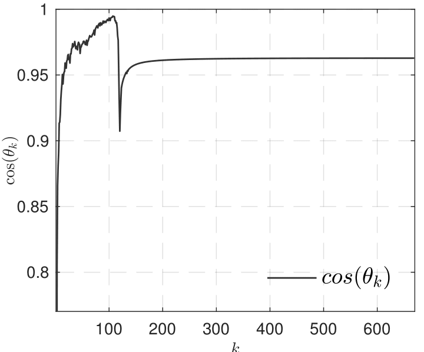  | 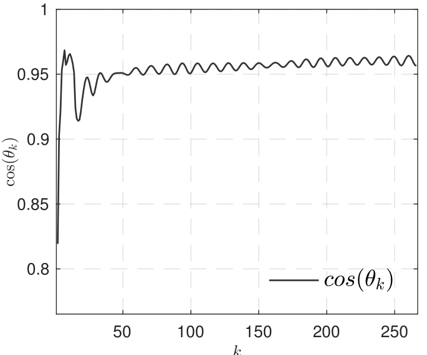  | 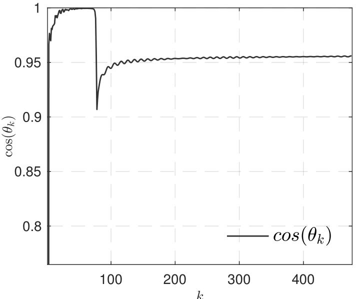  |
| 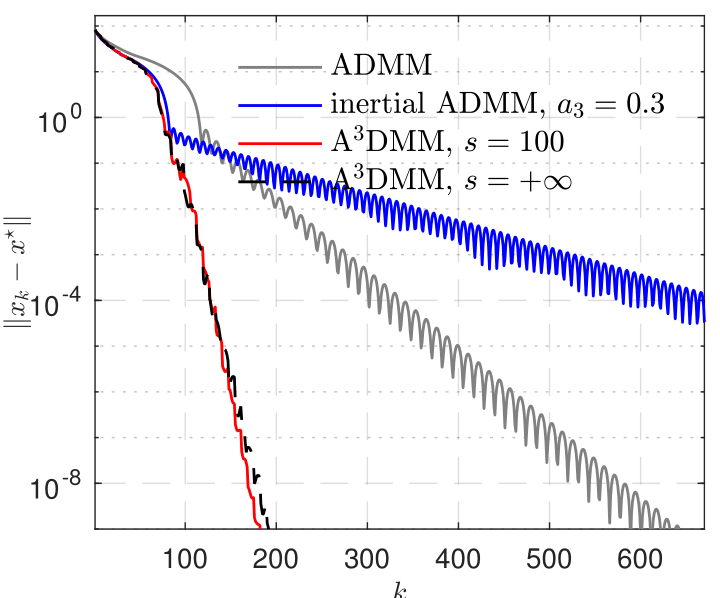  | 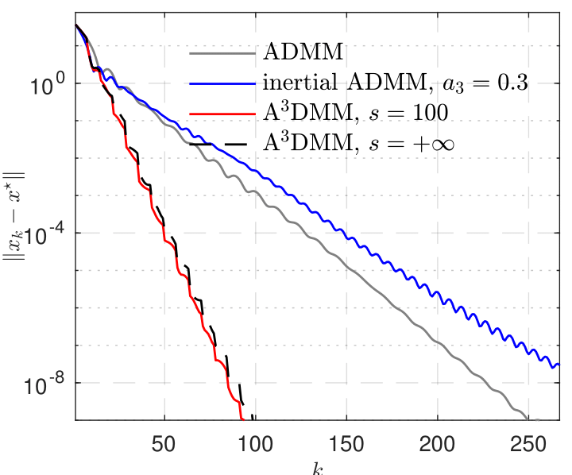  | 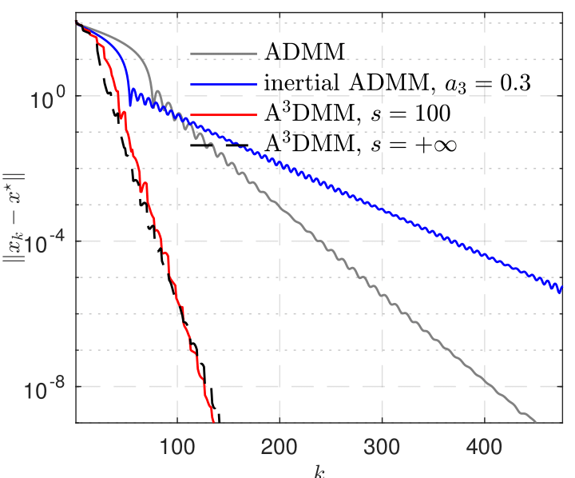  |
  

## LASSO 

The formulation of LASSO in the form of ADMM reads
$$
\begin{aligned}
\min_{x, y \in \mathbb{R}^{n}} ~ \mu \|x\|_1 + \tfrac{1}{2} \|Ky - f\|^2 \quad\textrm{such~that}\quad x - y = 0  ,
\end{aligned} 
$$
where $K \in \mathbb{R}^{m\times n} ,~ m < n$ is a random Gaussian matrix. 

| covtype  | ijcnn1  | phishing  |
|:-:|:-:|:-:|
| 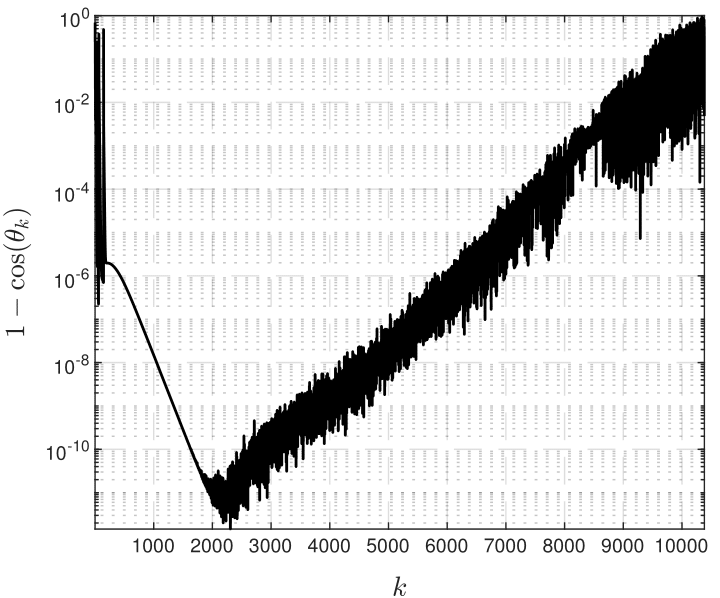  | 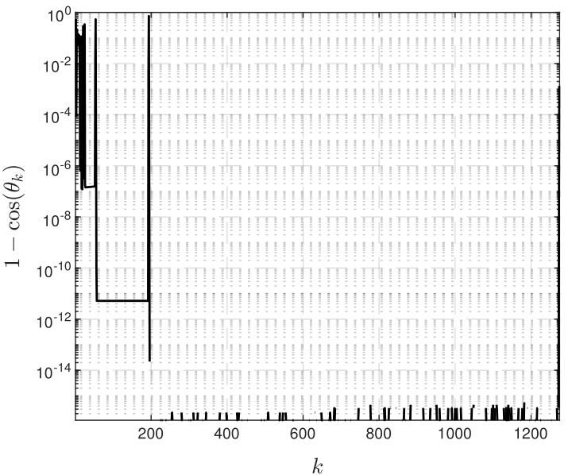  | 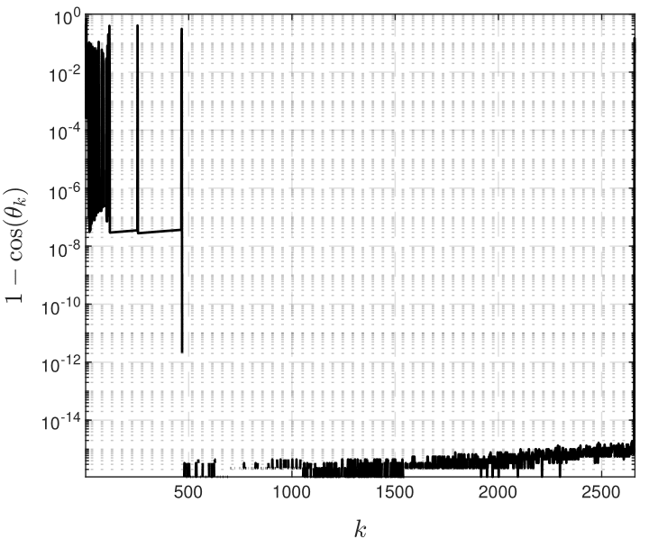 |
| 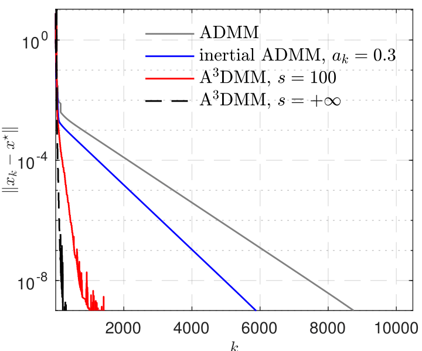  | 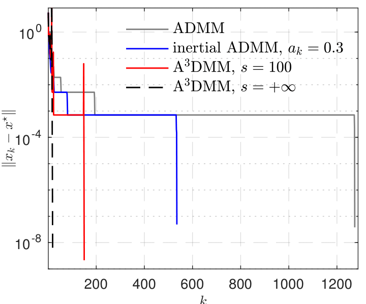  | 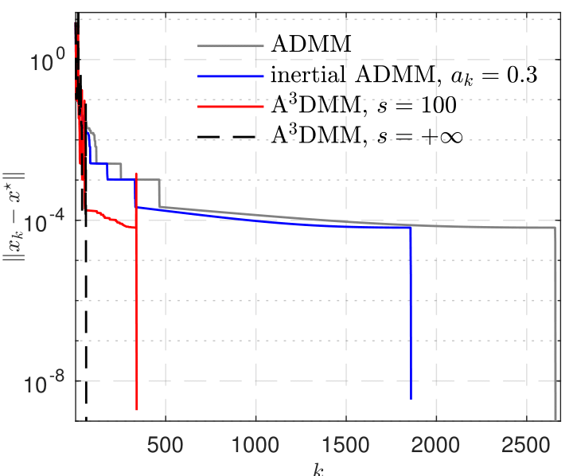  |

## Total variation based image inpainting

The TV based image inpainting can be formulated as
$$
\min_{x\in\mathbb{R}^{n\times n}} ~ \|\nabla x\|_{1} \quad \textrm{such~that} \quad \mathcal{P}_{\mathcal{S}}(x) = f  .
$$
Define $\Omega = \{x \in \mathbb{R}^{n\times n} : \mathcal{P}_{\mathcal{S}}(x) = f \}$, then (2) becomes
$$
\min_{x\in\mathbb{R}^{n\times n}, y\in\mathbb{R}^{2n\times n}} ~ \|y\|_{1} + \iota_{\Omega}(x)  \quad \textrm{such~that} \quad \nabla x - y = 0  ,
$$
which is special case of (1) with $A=\nabla, B=-\mathrm{Id}$ and $b=0$. For the update of $x_k$, we have that
$$
x_{k} = \mathrm{argmin}_{x\in\mathbb{R}^{n\times n} }~ \iota_{\Omega}(x) + \tfrac{\gamma}{2} \|\nabla x - \tfrac{1}{\gamma} ( {z}_{k-1} - 2\psi_{k-1} ) \|^2  ,
$$
which does not admit closed form solution. In the implementation, finite-step FISTA is applied to roughly solve the above problem. 

|  Angle $\theta_k$    |   Error $\|x_k-x^\star\|$  |   PSNR   |       
|:-:|:-:|:-:|
|   | 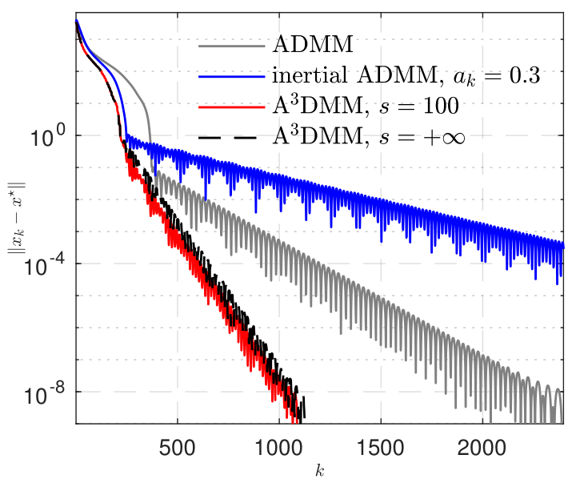 | 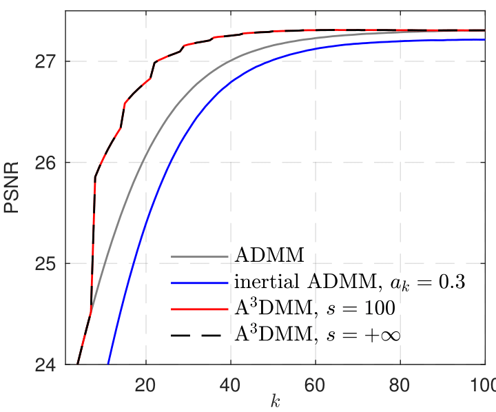  |

Image quality comparison at iteration step $k=30$

|  Original image    |   ADMM, PSNR = 26.6935  |   iADMM, PSNR = 26.3203  |        
|:-:|:-:|:-:|
|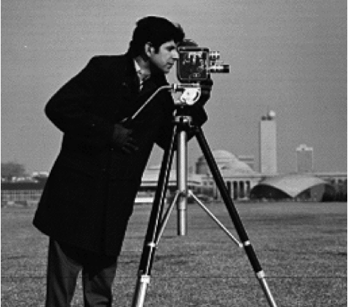  | 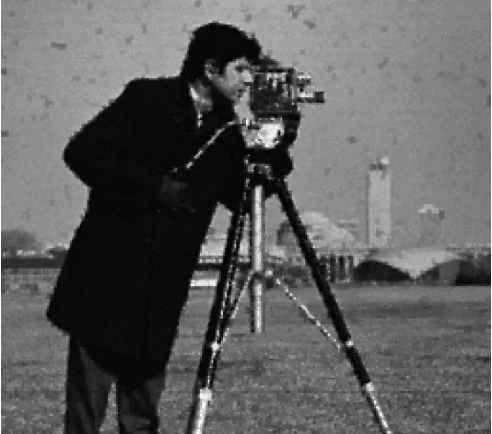 | 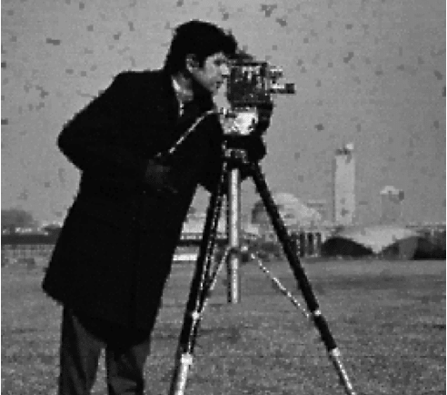  |
|  Corrupted image    |   A3DMM, $s=100$ PSNR = 27.1668  |   A3DMM, $s=+\infty$ PSNR = 27.1667   |
| 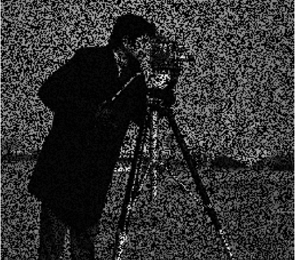  |  |   |

Copyright (c) 2019 Clarice Poon and Jingwei Liang